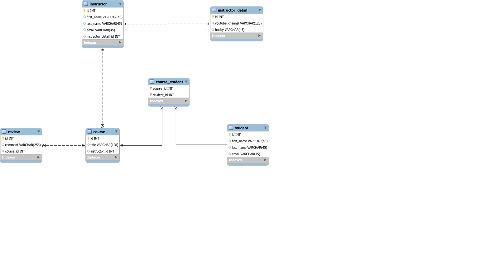

# 05-hibernate-advanced-mappings
Hibernate learning project.  
CRUD and Advanced Mappings: One To One, One To Many,  Many To Many, Uni and Bidirectional.

Step 1: Basic CRUD operation on a single table (student)  
!Keep in mind:  
  - PK 
  - Autoincrement

Step 2: Hibernate advanced mapping (multiple tables)  
  - One to One : unidirectional/bidirectional relation:  
  tables: instuctor, instructor_detail  
  !Keep in mind:  
      - FK 
      - Cascade operations
  - One to Many	bidirectional:  
  tables: instructor, course  
  !Keep in mind:  
      - Fetch type: Eager vs Lazy 

  - One to Many  unidirectional:  
  tables: course, review  
  !Keep in mind:  
      - @JoinColumn place in Course instead of Review

  - Many to Many:  
  tables: course, student  
  !Keep in mind:  
      - @JoinTable

Note:  
File to crate database are in sql_scripts folder.  

Building steps: File - New – Java Project.  
  - The 17 runnable classes from com.andrei.hibernate.advanced are numbered in logical order to construct and run the project.
Run As - Run on Server

Config: hibernate.cfg.xml.  
  
Lib: hibernate lib required; mysql-connector.   
(not a Spring project, not a Maven project)

Database Diagram:  
  

[BACK TO START PAGE](https://github.com/FlorescuAndrei/Start.git) 

